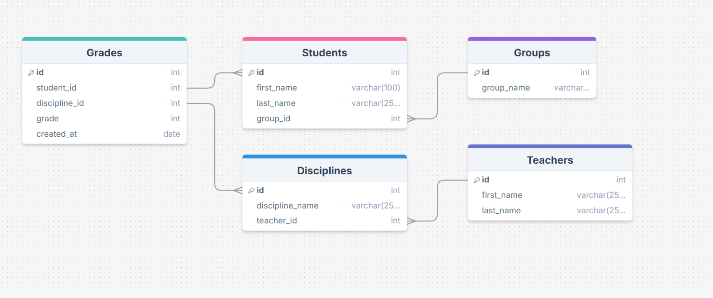
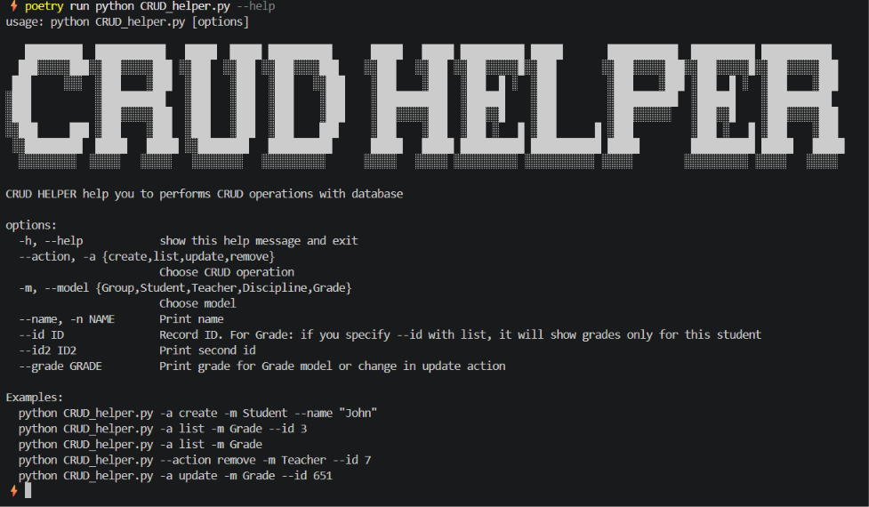
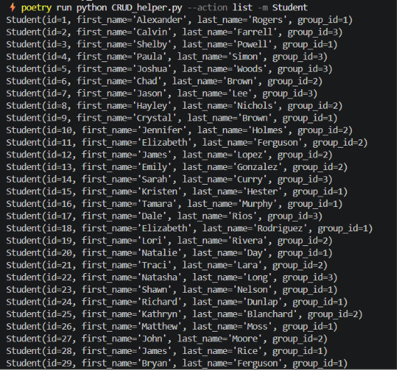
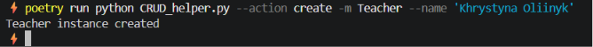
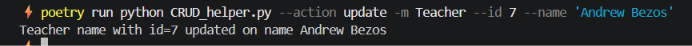
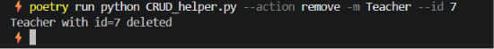

# 🏛️ University Database CLI Management Tool & Analytics Layer

Консольна утиліта та аналітичний інструмент для моделювання, міграції та адміністрування реляційної бази даних умовного навчального закладу. 

Проєкт демонструє еволюцію розробки: від низькорівневих аналітичних SQL-запитів до створення автоматизованої системи керування даними за допомогою ORM, міграцій та CLI-інтерфейсу.

---

## 📌 Про проєкт

Проєкт структурно розділений на два логічні модулі:

1. **Raw SQL Layer (`raw_sql_analytics/`):** Відповідає за дослідження реляційних зв'язків та написання SQL-запитів до бази даних **SQLite** за допомогою курсорів. Включає агрегації, об'єднання та фільтрації. Реалізовано можливість збереження результату в csv файл.
2. **ORM & CLI layer (`university_cli/`):** Включає архітектуру на базі **SQLAlchemy 2.0 ORM**, розгорнуту в контейнері **PostgreSQL** через **Docker**. Керування структурою БД реалізовано через міграції **Alembic**, а взаємодія з даними реалізована у вигляді повноцінної **CLI-програми** на базі модуля `argparse` для виконання CRUD-операцій.

---

## 🛠 Технологічний стек

| Категорія | Технології |
|---|---|
| Мова програмування | Python 3.13 |
| Бази даних | PostgreSQL, SQLite |
| ORM | SQLAlchemy 2.0 |
| Міграції | Alembic |
| Контейнеризація | Docker Compose |
| Інструменти тестування | Faker (генерація mock-даних) |
| Менеджер залежностей | Poetry |

---

## ✨ Функціонал

### Модуль 1: Чистий SQL (`raw_sql_analytics`)
- Створення структури зв'язків в базі даних за допомогою **ER-діаграми**.
- Генерація та наповнення бази SQLite випадковими даними за допомогою Faker (`seed_raw.py`).
- Реалізовано SQL-запити різного рівня складності (наприклад: пошук топ-5 студентів за середнім балом, середній бал у групах за предметом, курси конкретного викладача тощо).
- Додана можливість збереження результату SQL-запиту в csv файл.


### Модуль 2: ORM Система та CLI-утиліта (`university_cli`)
- Описано реляційну схему даних у вигляді Python-класів (моделі `Student`, `Group`, `Teacher`, `Discipline`, `Grade`).
- Реалізовано **CLI** утиліту для CRUD-операцій (Create, Read, Update, Delete) для будь-якої таблиці прямо через термінал.
- Генерація та наповнення бази PostgreSQL випадковими даними через сесії **SQLAlchemy**.
- Реалізовано аналогічні запити за допомогою **SQLAlchemy ORM**.

---

## 🗂 Структура проєкту

```
university-db-cli-tool/
│
├── raw_sql_analytics/             # Чистий SQL та SQLite
│   ├── sql_queries/               # Окремі файли SQL-запитів
│   ├── create_db.py               
│   ├── execute_query.py           # Скрипт для виконання запитів та збереження в CSV
│   ├── seed_raw.py                # Генерація даних через Faker
│   └── ER-diagram.png             # Схема зв'язків бази даних
│
├── university_cli/                # SQLAlchemy ORM & CLI
│   ├── alembic/     
│   ├── alembic.ini              
│   ├── db_config.py               
│   ├── models.py                  # Моделі SQLAlchemy 2.0 
│   ├── my_select.py               # Запити через SQLAlchemy ORM
│   ├── seed_orm.py                # Наповнення PostgreSQL через сесії ORM
│   ├── .env.example
│   ├── docker-compose.yaml
│   └── CRUD_helper.py             # CLI утиліта 
│
└── pyproject.toml                 
```

---

## 🚀 Як запустити

### 1. Клонуй репозиторій
```bash
git clone https://github.com/Khrystyna979/university-db-cli-tool.git
cd university-db-cli-tool
```

### 2. Встанови залежності через Poetry:
```bash
pip install poetry
poetry install
```

### Запуск Частини SQLAlchemy ORM + PostgreSQL

- Перейди в папку модуля university_cli:
```bash
cd university_cli
```
- Створи `.env` файл
```bash
cp .env.example .env
```
Заповни значення у `.env` (дивись `.env.example`)
- Запусти PostgreSQL через Docker
```bash
docker compose up -d
```
- Застосуй міграції Alembic для створення таблиць
```bash
poetry run alembic upgrade head
```
- Заповни базу даних фейковими даними через ORM-сесії
```bash
poetry run python seed_orm.py
```
- Використання консольної CLI-утиліти
Для перегляду всього списку доступних команд та аргументів запусти команду:
```bash
poetry run python CRUD_helper.py --help
```
- Приклади використання команд для адміністрування
Показати список усіх студентів:
```bash
poetry run python CRUD_helper.py --action list -m Student
```
- Створити нового викладача:
```bash
poetry run python CRUD_helper.py --action create -m Teacher --name 'Khrystyna Oliinyk'
```
- Оновити ім'я викладача за його ID
```bash
poetry run python CRUD_helper.py --action update -m Teacher --id 3 --name 'Andrew Bezos'
```
- Видалити запис про групу
```bash
poetry run python CRUD_helper.py --action remove -m Group --id 1
```
- Виконання запитів за допомогою SQLAlchemy
Кроки виконання:
1. Відкрийте файл `university_cli/my_select.py`
2. У рядку **220** оберіть функцію, за допомогою якої хочете виконати запит (наприклад, extra_select_2, select_8 тощо):

* Якщо запит потребує передачі аргументів (як-от ID студента чи групи), передайте їх:
```python
   if __name__ == '__main__':
    print(extra_select_2(2, 2))  # Вкажіть тут потрібну функцію та параметри
```
3. Виконайте команду в терміналі:
```bash
poetry run python my_select.py
```

### Запуск Частини (Чистий SQL + SQLite)
- Перейди в папку модуля
```bash
cd raw_sql_analytics
```
- Запусти скрипт створення бази
```bash
poetry run python create_db.py
```
- Запусти скрипт генерації випадкових даних
```bash
poetry run python seed_raw.py
```
- Кроки для запуску будь-якого запиту:  
1. Відкрийте файл `raw_sql_analytics/execute_query.py`
2. У рядку **4** змініть назву файлу на той запит, який хочете перевірити (наприклад, `query_1.sql`, `query_7.sql` тощо):
```python
   QUERY_FILE = 'sql_queries/query_7.sql'  # Вкажіть тут потрібний файл
```
* Якщо запит потребує передачі параметрів (як-от ID студента чи групи), передайте їх кортежем у функцію execute_query в самому низу файлу:
```python
   save_to_file(execute_query(QUERY_FILE, (5, 2)), CSV_FILE)
```
- Перейдіть у папку модуля та виконайте команду в терміналі:
```bash
cd raw_sql_analytics
poetry run python execute_query.py
```
- Результати виконання запиту відобразяться в терміналі та збережуться у файл result.csv

---

## 📸 Скріншоти







---

## 📊 Аналітичні можливості (Результати SQL-запитів)

Завдяки реалізованій структурі бази даних, цей інструмент дозволяє отримувати ключову аналітику щодо навчального процесу. За допомогою скриптів можна дізнатись:
1. 5 студентів із найбільшим середнім балом з усіх предметів.
2. Студента із найвищим середнім балом з певного предмета.
3. Середній бал у групах з певного предмета.
4. Середній бал на потоці (по всій таблиці оцінок).
5. Курси, які читає певний викладач.
6. Список студентів у певній групі.
7. Оцінки студентів у окремій групі з певного предмета.
8. Середній бал, який ставить певний викладач зі своїх предметів.
9. Список курсів, які відвідує певний студент.
10. Список курсів, які певному студенту читає певний викладач.
11. Середній бал, який певний викладач ставить певному студентові.
12. Оцінки студентів у певній групі з певного предмета на останньому занятті.

---

## 👩‍💻 Автор

**Oliinyk Khrystyna** — [GitHub](https://github.com/Khrystyna979) | [LinkedIn](https://www.linkedin.com/in/khrystyna-oliinyk-200110376)